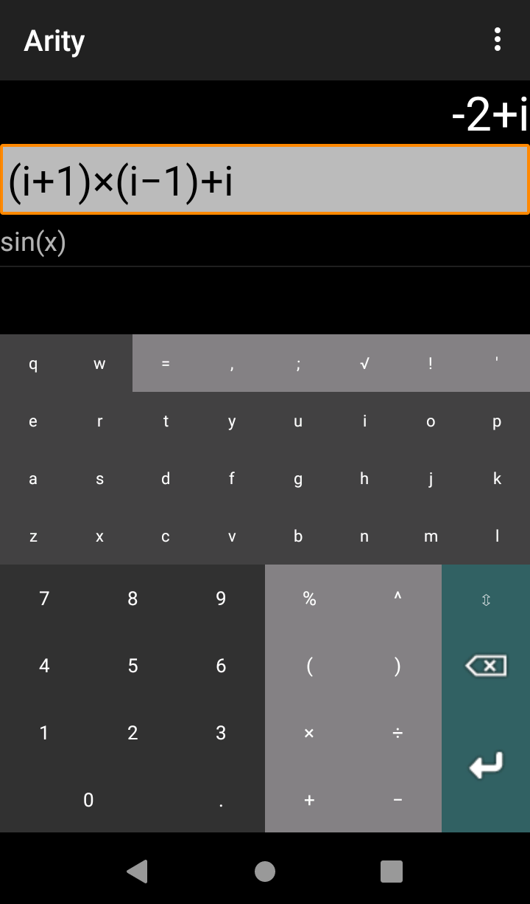
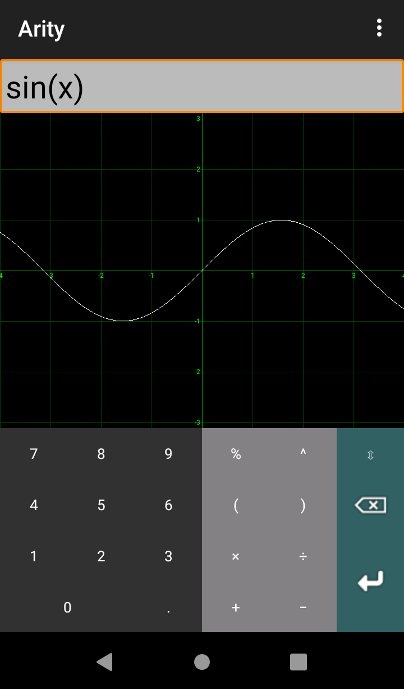
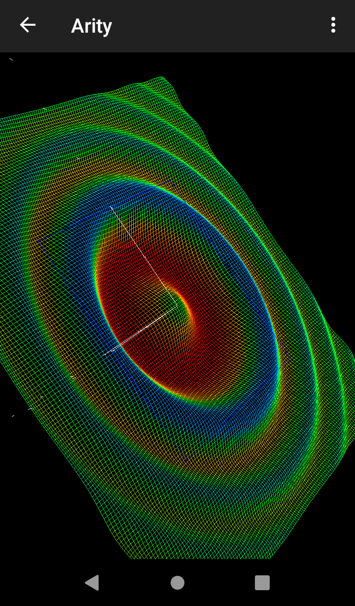

<pre>Send a coffee to woheller69@t-online.de 
</pre>

# Arity
Scientific calculator with complex numbers and graphing of user-defined functions. 

     

## License

This is an updated (Android 12, SDK 32) fork of 

https://archive.softwareheritage.org/browse/origin/directory/?origin_url=https://arity-calculator.googlecode.com/hg/

It uses the Arity library from here:

https://github.com/Xlythe/Arity

Both are published under Apache License 2.0 license, Copyright (C) 2007-2010 Mihai Preda

## Try my other apps

| **RadarWeather** | **Gas Prices** | **Smart Eggtimer** | 
|:---:|:---:|:---:|
| |  |  |
| **Level** | **hEARtest** | **GPS Cockpit** |
|  |  |  |
| **Audio Analyzer** | **LavSeeker** | **TimeLapseCam** |
|  | |  |
| **Arity** | **omWeather** | **solXpect** |
|  |  |  |
